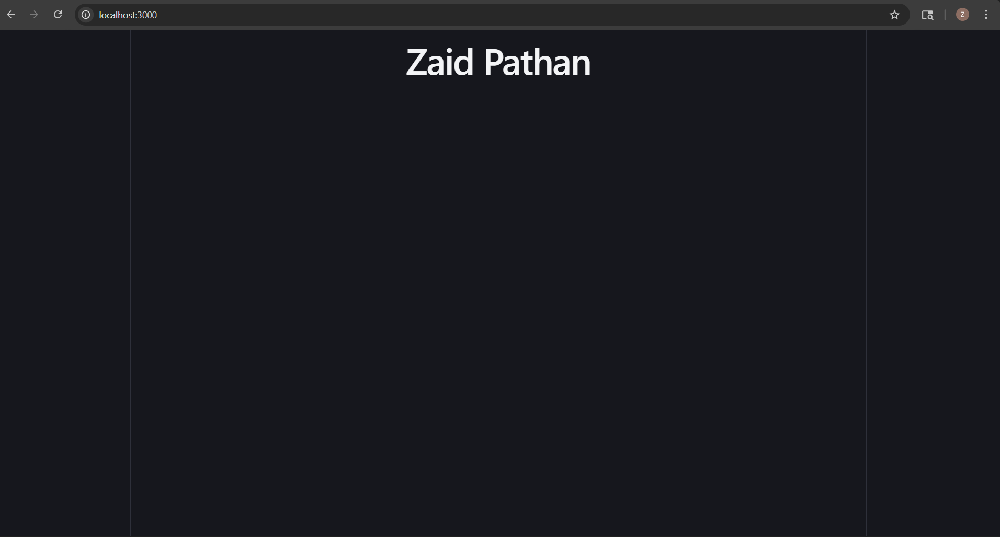
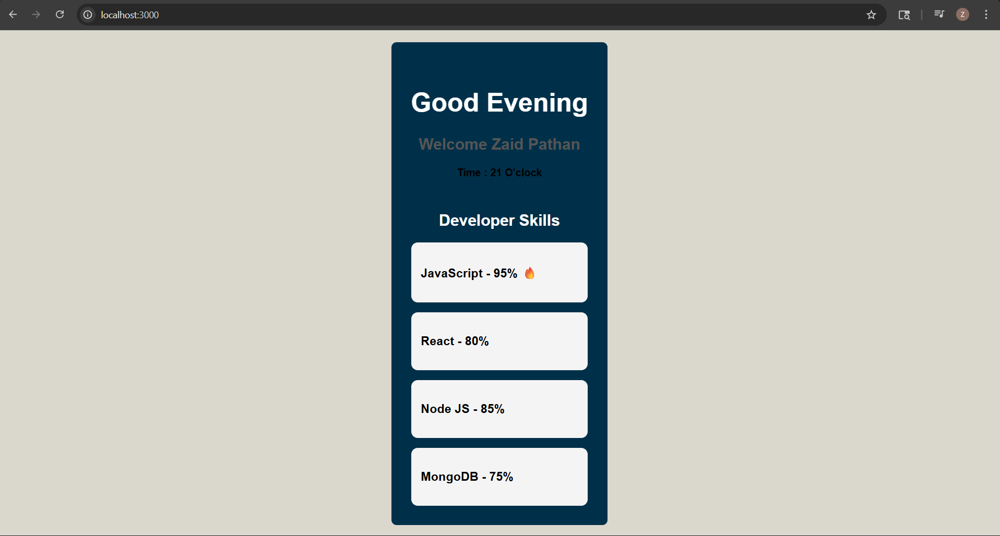
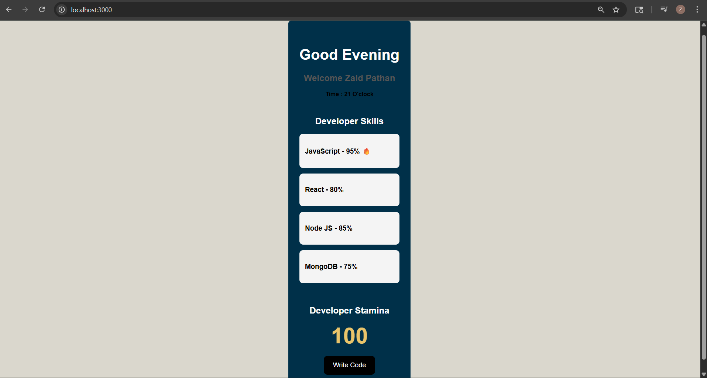
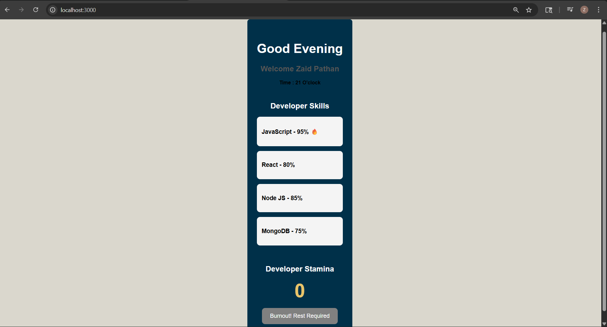

# 📑 Daily Task Submission Report

**MERN Stack Internship | Prelytix Private Limited**

| Field             | Details               |
| :---------------- | :-------------------- |
| **Student Name**  | Zaid Pathan           |
| **Internship ID** | ND                    |
| **Date**          | 2026-05-12            |
| **Course Day**    | Day 1                 |
| **GitHub Repo**   | https://github.com/zaidpathann/summer_internship.git |

---

## 🎯 Daily Objective

> Build a Developer Stamina Dashboard using React and Vite while learning environment setup, reusable components, prop passing, and React state management.

---

## 🛠️ Implementation & Changes (Self-Documentation)

### 1. New Features / Logic Implemented

* **What:** Implemented a Developer Stamina Dashboard with dynamic greeting, reusable skill components, and stamina state management.

* **How:**

  * Created a React project using Vite.
  * Added environment variables using `.env`.
  * Configured Vite server port to `3000`.
  * Created reusable React components:

    * `Header.jsx`
    * `SkillList.jsx`
    * `SkillBadge.jsx`
  * Implemented dynamic greeting logic using `new Date().getHours()`.
  * Passed skill data using React props.
  * Used `.map()` to dynamically render skills.
  * Added conditional icon rendering for skills above 90%.
  * Implemented stamina state logic using `useState`.
  * Added critical stamina reduction every 5th click using modulus operator `%`.
  * Disabled the button when stamina reached `0`.

* **Why:**

  * To practice React fundamentals including component architecture, state management, props, conditional rendering, and dynamic UI updates.

---

### 2. UI/UX Enhancements

* Added dynamic greeting system:

  * Good Morning
  * Good Afternoon
  * Good Evening
* Displayed intern name dynamically from environment variables.
* Added reusable skill cards UI.
* Added burnout state UI with disabled button.
* Added organized layout and custom CSS styling.
* Used custom CSS class prefixes (`zp-`) for anti-copy verification.

---

### 3. Database / Backend Updates

* No backend or database implementation was required for Day 1 tasks.

---

## 💻 Code Snippet: My Primary Contribution

```javascript id="m87rhb"
if(newClickCount % 5 === 0){
   reduction = 15
}
```

The modulus operator was used to trigger critical stamina reduction on every 5th click.

---

## 📸 Screenshots / Proof of Work

> **Task 1 - Environment Setup**
> 

---

> **Task 2 - Dynamic Greeting**
> 

---

> **Task 3 - Skill Prop Injection**
> 

---

> **Task 4 - Stamina Running State**
> 

---

> **Task 4 - Burnout State**
> 

---

## 🛑 Challenges Faced & Solutions

* **Problem:** Environment variable was not displaying initially.
* **Solution:** Corrected `.env` file location and restarted the Vite development server.

---

* **Problem:** Greeting conditions were not matching correctly.
* **Solution:** Updated hour range conditions using `getHours()` and tested with different system times.

---

* **Problem:** Stamina value was becoming negative.
* **Solution:** Added conditional checks to stop stamina below zero.

---

## 💡 Key Learnings

* Learned how to setup a React project using Vite.
* Learned how Vite environment variables work.
* Learned reusable React component architecture.
* Learned React props and `.map()` rendering.
* Learned state management using `useState`.
* Learned practical usage of modulus operator `%`.
* Learned conditional rendering and UI state management.

---

## 🔗 Live Preview (If applicable)

* **Deployment Link:** Not deployed yet.

---

**Signature:**
Zaid Pathan
