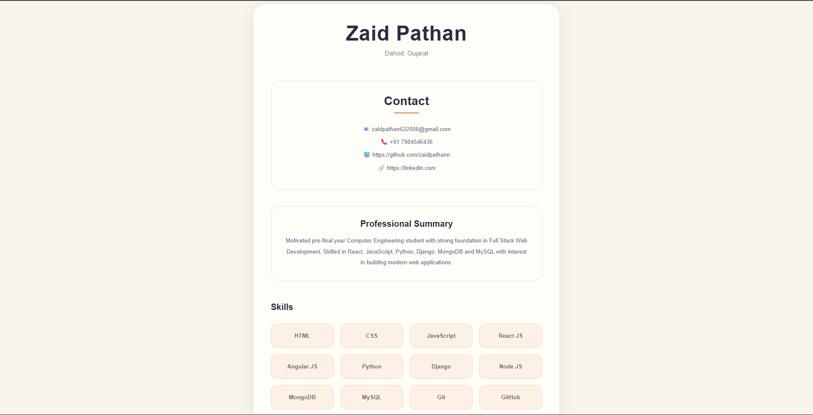
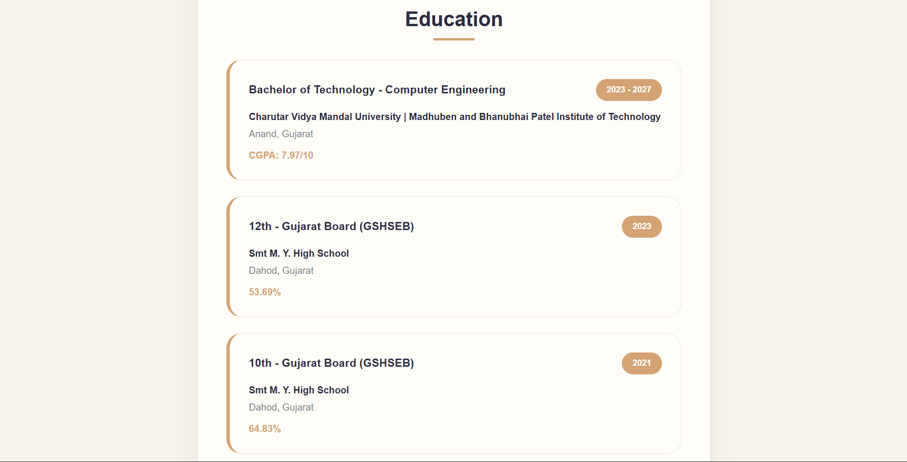
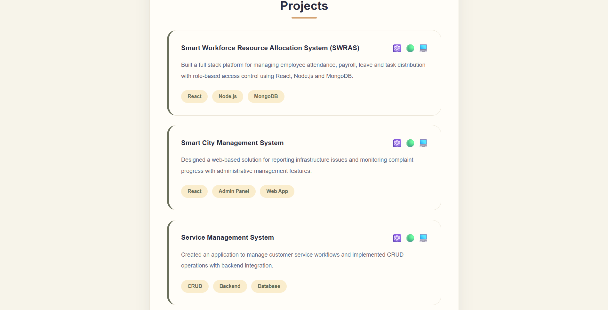
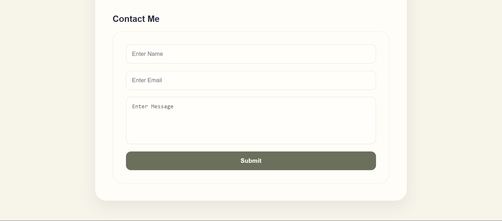

# 📑 Day 2 Task Submission Report

**MERN Stack Internship | Prelytix Private Limited**

| Field             | Details               |
| :---------------- | :-------------------- |
| **Student Name**  | Zaid Pathan           |
| **Internship ID** | ND    |
| **Date**          | 2026-05-13            |
| **Course Day**    | Day 2                 |
| **GitHub Repo**   | https://github.com/zaidpathann/summer_internship.git |

---

# 🎯 Daily Objective

> Build a professional Resume Builder application using React hooks, reusable components, and dynamic rendering.

---

# 🛠️ Implementation & Changes (Self-Documentation)

## 1. New Features / Logic Implemented

* **What:** Developed a Resume Builder web application using React and Vite.

* **How:**

  * Created reusable React components:

    * Header
    * Contact
    * Summary
    * Skills
    * Education
    * Projects
    * ContactForm
  * Used `useEffect` hook for simulated API loading.
  * Used `useState` for dynamic form handling.
  * Implemented responsive project and education cards.
  * Added hover effects and professional UI styling.
  * Integrated contact form submission logic.

* **Why:**

  * To practice React component architecture, hooks, state management, and UI design principles.

---

## 2. UI/UX Enhancements

* Added modern resume layout.
* Added responsive skills grid.
* Added project cards with hover animations.
* Added professional education timeline cards.
* Added custom color palette styling.
* Added responsive contact form.
* Added loading screen using React hooks.

---

## 3. Database / Backend Updates

* No backend or database integration was required for Day 2 tasks.

---

# 💻 Code Snippet: My Primary Contribution

```javascript
useEffect(() => {

   setTimeout(() => {
      setResumeData(data)
   }, 1000)

}, [])
```

This hook was used to simulate API loading and dynamically render resume data.

---

# 📸 Screenshots / Proof of Work

## Resume Builder Home UI



---

## Education Section



---

## Projects Section



---

## Contact Form



---

# 🛑 Challenges Faced & Solutions

## Problem

* Component styling was initially too basic.

## Solution

* Redesigned the layout using a modern color palette and hover effects.

---

## Problem

* Form state was not updating correctly.

## Solution

* Implemented controlled components using `useState`.

---

# 💡 Key Learnings

* Learned React `useEffect` hook.
* Learned dynamic state handling.
* Learned reusable component architecture.
* Learned modern responsive UI design.
* Learned controlled form handling.
* Learned React-based layout structuring.

---

# 🔗 Live Preview 

* Deployment not done yet.

---

**Signature:**
Zaid Pathan
