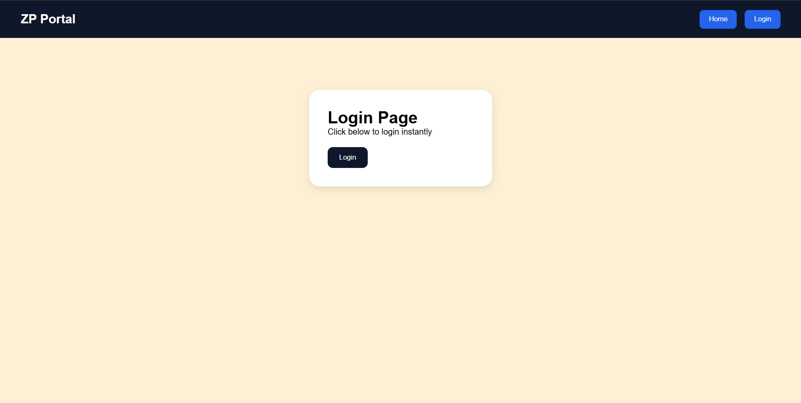
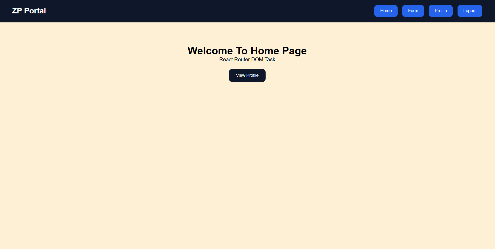
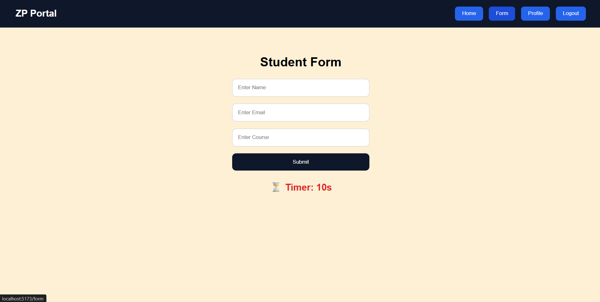
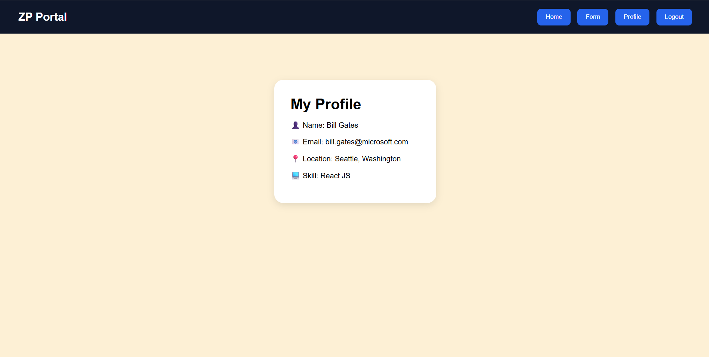

# 📑 Day 3 Task Submission Report

**MERN Stack Internship | Prelytix Private Limited**

| Field             | Details               |
| :---------------- | :-------------------- |
| **Student Name**  | Zaid Pathan           |
| **Internship ID** | ND    |
| **Date**          | 2026-05-14            |
| **Course Day**    | Day 3                 |
| **GitHub Repo**   | https://github.com/zaidpathann/summer_internship.git |

---

# 🎯 Daily Objective

> Build a React Router based multi-page navigation system with login/logout functionality, protected routes, profile management, and timer-based form handling.

---

# 🛠️ Implementation & Changes (Self-Documentation)

## 1. New Features / Logic Implemented

* **What:** Developed a multi-page React Router application with authentication-based navbar rendering.

* **How:**

  * Implemented `BrowserRouter` using React Router DOM.
  * Created reusable Navbar component.
  * Created pages:

    * Home
    * Login
    * Form
    * Profile
  * Added dynamic navbar rendering based on login state.
  * Implemented login and logout functionality.
  * Added protected routes using `Navigate`.
  * Added form page with 10-second countdown timer.
  * Used `useEffect` for timer logic.
  * Added alert popup after timer completion.

* **Why:**

  * To practice routing, conditional rendering, authentication flow, and timer-based side effects in React.

---

## 2. UI/UX Enhancements

* Added responsive navbar.
* Added protected route handling.
* Added dynamic profile visibility.
* Added modern card-based UI.
* Added interactive navigation buttons.
* Added timer display UI.

---

## 3. Database / Backend Updates

* No backend or database integration was required for Day 3 tasks.

---

# 💻 Code Snippet: My Primary Contribution

```javascript
useEffect(() => {

   if(timer === 0){
      alert("10 Seconds Completed")
      return
   }

   const interval = setInterval(() => {
      setTimer((prev) => prev - 1)
   }, 1000)

   return () => clearInterval(interval)

}, [timer])
```

This logic was used to implement the dynamic countdown timer functionality.

---

# 📸 Screenshots / Proof of Work

## Before Login Navbar



---

## After Login Navbar



---

## Form Page With Timer



---

## Profile Page



---

# 🛑 Challenges Faced & Solutions

## Problem

* Routing structure was initially not organized.

## Solution

* Created separate pages and reusable Navbar component.

---

## Problem

* Timer continued running unnecessarily.

## Solution

* Used cleanup function inside `useEffect` to clear intervals.

---

# 💡 Key Learnings

* Learned React Router DOM.
* Learned BrowserRouter configuration.
* Learned protected routing using `Navigate`.
* Learned authentication state handling.
* Learned timer management using `useEffect`.
* Learned reusable navigation architecture.

---

# 🔗 Live Preview 

* Deployment not done yet.

---

**Signature:**
Zaid Pathan
