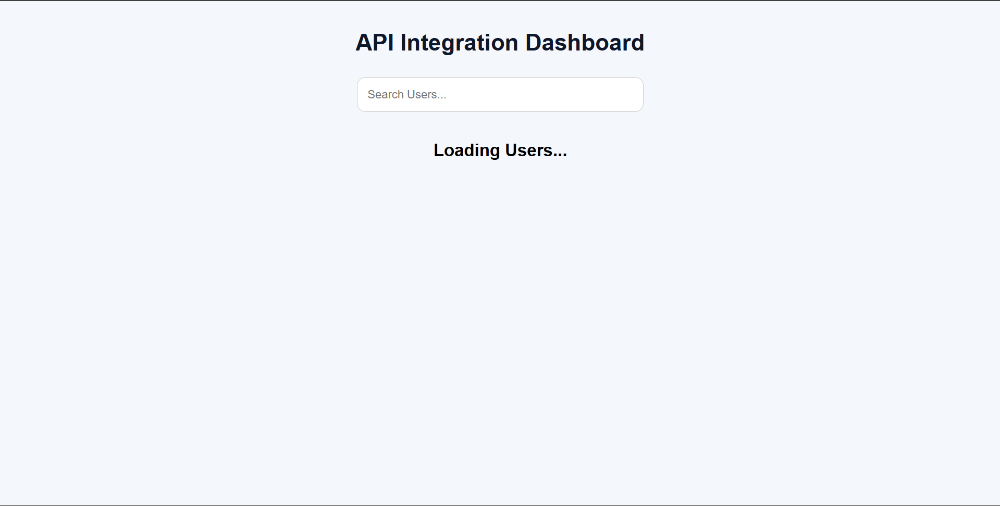
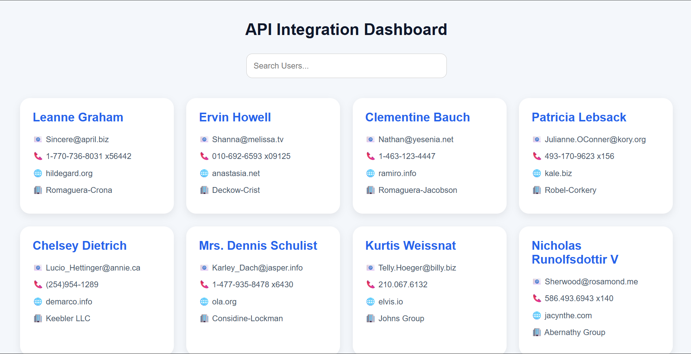
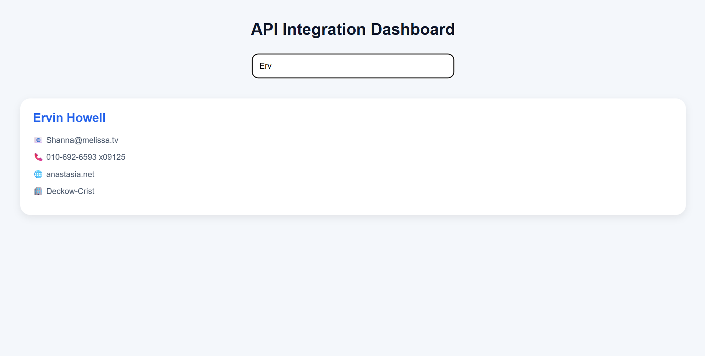

# 📑 Day 4 Task Submission Report

**MERN Stack Internship | Prelytix Private Limited**

| Field             | Details               |
| :---------------- | :-------------------- |
| **Student Name**  | Zaid Pathan           |
| **Internship ID** | ND    |
| **Date**          | 2026-05-15            |
| **Course Day**    | Day 4                 |
| **GitHub Repo**   | https://github.com/zaidpathann/summer_internship.git |

---

# 🎯 Daily Objective

> Build an API Integration Dashboard using React, Axios, and external REST APIs while learning asynchronous data fetching, loading states, and dynamic rendering.

---

# 🛠️ Implementation & Changes (Self-Documentation)

## 1. New Features / Logic Implemented

* **What:** Developed an API Integration Dashboard using React and Axios.

* **How:**

  * Integrated external REST API using Axios.
  * Used `useEffect` hook for API data fetching.
  * Used `useState` for state management.
  * Created reusable `UserCard` component.
  * Implemented dynamic user rendering using `.map()`.
  * Added loading state handling.
  * Added error handling using `try-catch`.
  * Implemented search filtering functionality.
  * Designed responsive card-based UI.

* **Why:**

  * To practice real-world API integration, asynchronous programming, React hooks, and dynamic UI rendering.

---

## 2. UI/UX Enhancements

* Added responsive grid layout.
* Added hover animations on cards.
* Added loading state display.
* Added error message handling UI.
* Added search bar for dynamic filtering.
* Added modern card-based interface.

---

## 3. Database / Backend Updates

* No custom backend was created.
* External API used:

```text
https://jsonplaceholder.typicode.com/users
```

---

# 💻 Code Snippet: My Primary Contribution

```javascript
useEffect(() => {

   const fetchUsers = async () => {

      try {

         const response = await axios.get(
            "https://jsonplaceholder.typicode.com/users"
         )

         setUsers(response.data)

      }
      catch(err){

         setError("Failed To Fetch Users")

      }
      finally{

         setLoading(false)

      }
   }

   fetchUsers()

}, [])
```

This logic was used to fetch and render API data dynamically using Axios and React hooks.

---

# 📸 Screenshots / Proof of Work

## Loading State



---

## User Dashboard UI



---

## Search Functionality



---

# 🛑 Challenges Faced & Solutions

## Problem

* API data was not rendering initially.

## Solution

* Corrected Axios request handling and verified API response structure.

---

## Problem

* Search filtering was case-sensitive.

## Solution

* Used `toLowerCase()` for optimized filtering.

---

# 💡 Key Learnings

* Learned API integration using Axios.
* Learned asynchronous programming using `async-await`.
* Learned React `useEffect` hook.
* Learned loading and error state management.
* Learned dynamic rendering using `.map()`.
* Learned search filtering functionality.
* Learned reusable React component architecture.

---

# 🔗 Live Preview 

* Deployment not done yet.

---

**Signature:**
Zaid Pathan
