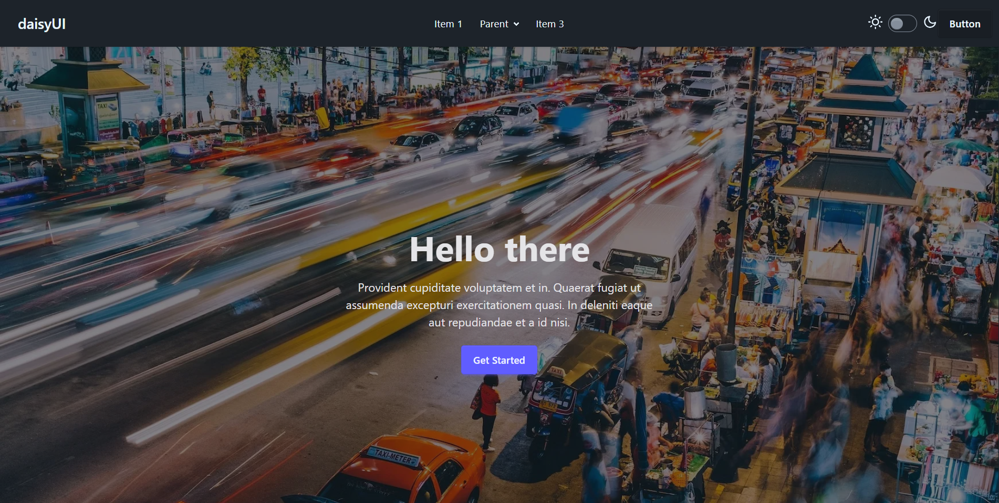
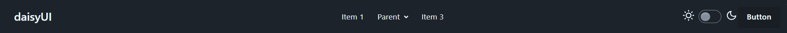
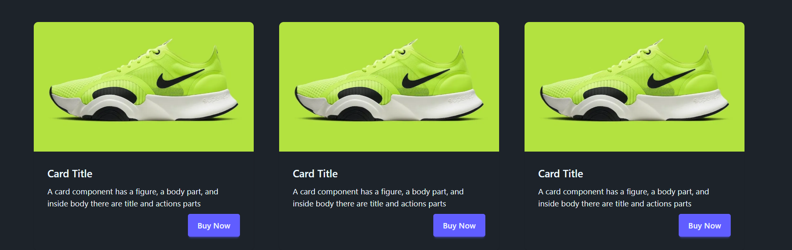

# 📑 Day 5 Task Submission Report

**MERN Stack Internship | Prelytix Private Limited**

| Field             | Details               |
| :---------------- | :-------------------- |
| **Student Name**  | Zaid Pathan           |
| **Internship ID** | ND    |
| **Date**          | 2026-05-16            |
| **Course Day**    | Day 5                 |
| **GitHub Repo**   | https://github.com/zaidpathann/summer_internship.git |

---

# 🎯 Daily Objective

> Integrate modern UI libraries such as Tailwind CSS v4, DaisyUI, and Flowbite into a React + Vite project and build a responsive UI page using library components.

---

# 🛠️ Implementation & Changes (Self-Documentation)

## 1. New Features / Logic Implemented

* **What:** Built a modern responsive dashboard page using Tailwind CSS, DaisyUI, and Flowbite.

* **How:**

  * Installed and configured Tailwind CSS v4.
  * Integrated DaisyUI plugin.
  * Installed Flowbite library.
  * Updated `vite.config.js` for Tailwind plugin integration.
  * Added Tailwind and DaisyUI imports inside `index.css`.
  * Created responsive UI sections:

    * Navbar
    * Hero Section
    * Cards Section
  * Used Tailwind utility classes for layout and responsiveness.
  * Used DaisyUI semantic components such as:

    * `btn`
    * `card`
    * `navbar`
    * `hero`
  * Added Flowbite-inspired card styling.

* **Why:**

  * To learn library integration, utility-first styling, responsive layouts, and reusable UI component systems.

---

## 2. UI/UX Enhancements

* Added responsive dashboard layout.
* Added hover effects on buttons and cards.
* Added responsive grid system.
* Added modern hero section.
* Added clean navigation bar.
* Added professional card-based UI.
* Used modern color combinations and spacing.

---

## 3. Database / Backend Updates

* No backend or database integration was required for Day 5 tasks.

---

# 💻 Code Snippet: My Primary Contribution

```jsx
<div className="card bg-base-100 shadow-xl">

   <div className="card-body">

      <h2 className="card-title">
         DaisyUI
      </h2>

      <p>
         Easy semantic UI components.
      </p>

      <div className="card-actions justify-end">

         <button className="btn btn-primary">
            Learn
         </button>

      </div>

   </div>

</div>
```

This component demonstrates the integration of DaisyUI semantic classes with Tailwind utility styling.

---

# 📸 Screenshots / Proof of Work

## Full Dashboard UI



---

## Navbar Section



---

## Cards Section



---

# 🛑 Challenges Faced & Solutions

## Problem

* Tailwind styles were not loading initially.

## Solution

* Correctly configured Tailwind plugin inside `vite.config.js` and restarted the development server.

---

## Problem

* DaisyUI component classes were not applying.

## Solution

* Added `@plugin "daisyui";` inside `src/index.css` after Tailwind import.

---

# 💡 Key Learnings

* Learned Tailwind CSS v4 integration.
* Learned DaisyUI plugin configuration.
* Learned Flowbite installation and usage.
* Learned utility-first CSS workflow.
* Learned responsive UI design.
* Learned reusable component styling.
* Learned semantic UI component usage.

---

# 🔗 Live Preview 

* Deployment not done yet.

---

**Signature:**
Zaid Pathan
