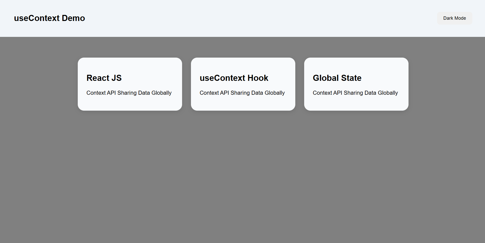
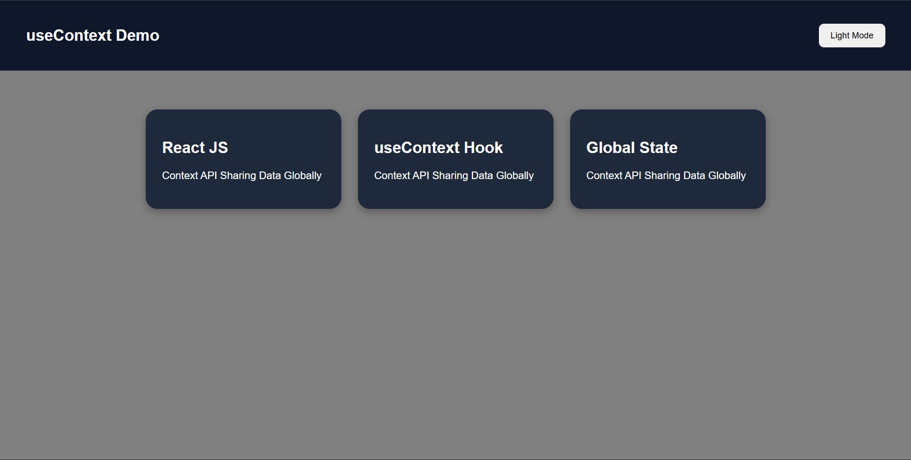
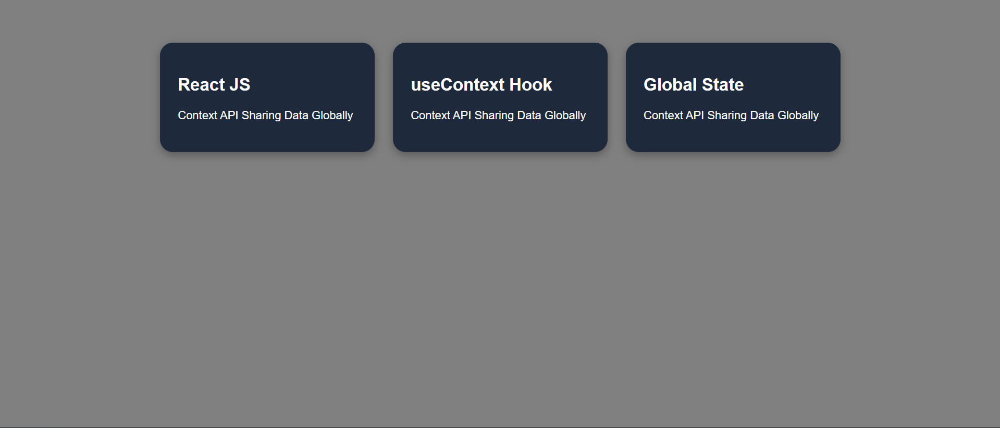

# 📑 Day 6 Task Submission Report

**MERN Stack Internship | Prelytix Private Limited**

| Field             | Details               |
| :---------------- | :-------------------- |
| **Student Name**  | Zaid Pathan           |
| **Internship ID** | ND    |
| **Date**          | 2026-05-18            |
| **Course Day**    | Day 6                 |
| **GitHub Repo**   | https://github.com/zaidpathann/summer_internship.git |

---

# 🎯 Daily Objective

> Learn and implement React Context API and the `useContext` hook to share global state across multiple components without prop drilling.

---

# 🛠️ Implementation & Changes (Self-Documentation)

## 1. New Features / Logic Implemented

* **What:** Built a Theme Switcher Dashboard using React Context API and `useContext` hook.

* **How:**

  * Created a global context using `createContext()`.
  * Created a `ThemeProvider` component.
  * Wrapped the entire application inside `ThemeProvider`.
  * Used `useState` to manage dark/light theme.
  * Used `useContext` hook inside nested components.
  * Implemented dynamic theme switching functionality.
  * Created reusable components:

    * Navbar
    * Dashboard
    * Card
  * Applied conditional styling based on global theme state.

* **Why:**

  * To understand global state management and avoid prop drilling in React applications.

---

## 2. UI/UX Enhancements

* Added dark mode and light mode support.
* Added responsive dashboard layout.
* Added reusable card components.
* Added dynamic theme-based styling.
* Added clean modern UI design.
* Added interactive theme toggle button.

---

## 3. Database / Backend Updates

* No backend or database integration was required for Day 6 tasks.

---

# 💻 Code Snippet: My Primary Contribution

```jsx
const { darkMode, toggleTheme } = useContext(ThemeContext)
```

This hook was used to access globally shared theme state inside nested components without passing props manually.

---

# 📸 Screenshots / Proof of Work

## Light Mode UI



---

## Dark Mode UI



---

## Dashboard Cards Section



---

# 🛑 Challenges Faced & Solutions

## Problem

* Theme data was not accessible in deeply nested components.

## Solution

* Implemented Context API and wrapped the application inside `ThemeProvider`.

---

## Problem

* Theme styles were not updating dynamically.

## Solution

* Used conditional rendering and dynamic class assignment based on `darkMode` state.

---

# 💡 Key Learnings

* Learned React Context API.
* Learned `createContext()` usage.
* Learned `useContext` hook.
* Learned Provider pattern.
* Learned global state management.
* Learned how to avoid prop drilling.
* Learned dynamic theme switching.
* Learned reusable component architecture.

---

# 🔗 Live Preview 

* Deployment not done yet.

---

**Signature:**
Zaid Pathan
