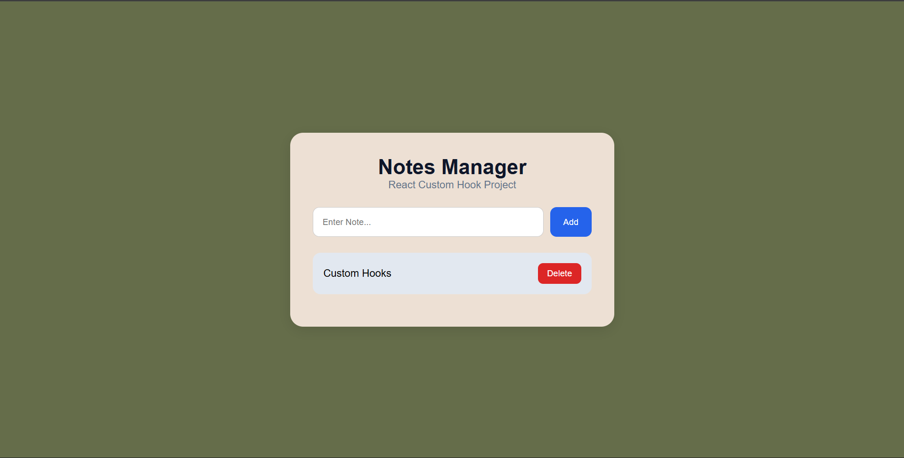

# 📑 Day 7 Task Submission Report

**MERN Stack Internship | Prelytix Private Limited**

| Field             | Details               |
| :---------------- | :-------------------- |
| **Student Name**  | Zaid Pathan           |
| **Internship ID** | ND    |
| **Date**          | 2026-05-19            |
| **Course Day**    | Day 7                 |
| **GitHub Repo**   | https://github.com/zaidpathann/summer_internship.git |

---

# 🎯 Daily Objective

> Learn and implement React Custom Hooks to create reusable logic and improve component architecture.

---

# 🛠️ Implementation & Changes (Self-Documentation)

## 1. New Features / Logic Implemented

* **What:** Built a Notes Manager project using React Custom Hooks.

* **How:**

  * Created reusable custom hook `useNotes`.
  * Managed notes state using `useState`.
  * Implemented Add Note and Delete Note functionality.
  * Created reusable React components:

    * NoteForm
    * NotesList
  * Applied component-based project structure.
  * Implemented dynamic rendering using `.map()`.

* **Why:**

  * To understand reusable logic sharing and clean React architecture using custom hooks.

---

## 2. UI/UX Enhancements

* Added responsive notes dashboard UI.
* Added reusable note cards.
* Added interactive Add/Delete buttons.
* Added clean modern layout and spacing.
* Added conditional rendering for empty notes list.

---

## 3. Database / Backend Updates

* No backend or database integration was required for Day 7 tasks.

---

# 💻 Code Snippet: My Primary Contribution

```jsx
function useNotes() {

   const [notes, setNotes] = useState([])

   const addNote = (text) => {

      const newNote = {
         id: Date.now(),
         text
      }

      setNotes((prev) => [...prev, newNote])

   }

   return {
      notes,
      addNote
   }
}
```

This custom hook was used to manage reusable notes logic across components.

---

# 📸 Screenshots / Proof of Work

## Notes Dashboard UI



---

# 🛑 Challenges Faced & Solutions

## Problem

* Managing notes logic inside multiple components became repetitive.

## Solution

* Extracted reusable logic into a custom hook using `useNotes`.

---

## Problem

* Dynamic notes rendering was initially not updating properly.

## Solution

* Used React state updates with spread operator and `.filter()` method.

---

# 💡 Key Learnings

* Learned React Custom Hooks.
* Learned reusable state management.
* Learned logic separation in React.
* Learned component-based architecture.
* Learned dynamic rendering using `.map()`.
* Learned add/delete operations handling.

---

# 🔗 Live Preview 

* Deployment not done yet.

---

**Signature:**
Zaid Pathan
