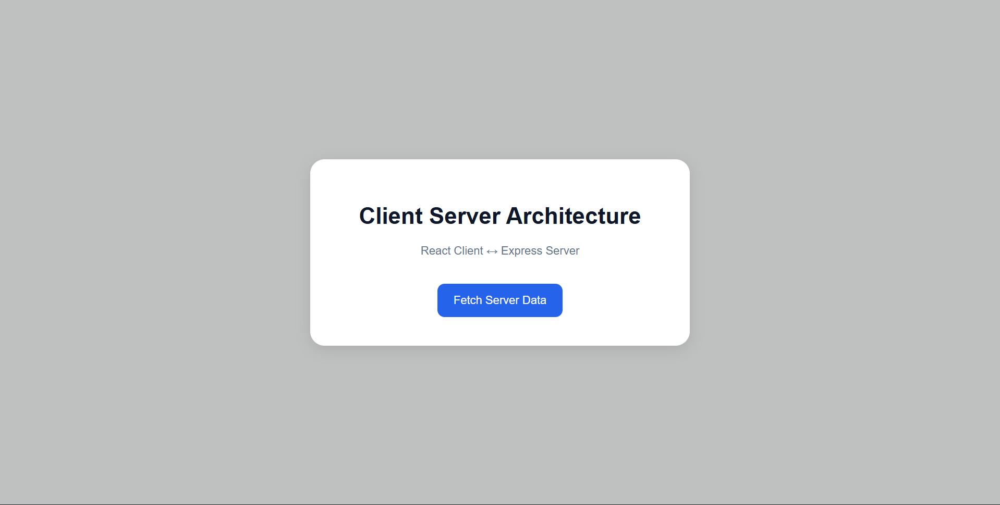
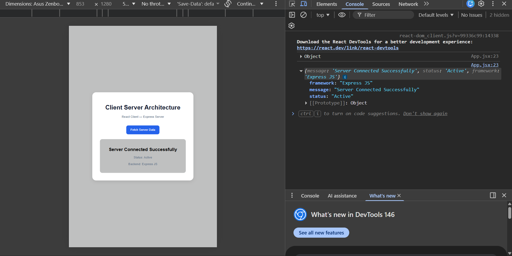
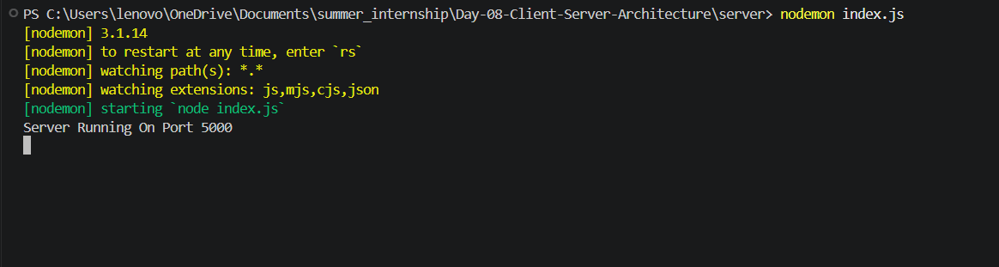

# 📑 Day 8 Task Submission Report

**MERN Stack Internship | Prelytix Private Limited**

| Field             | Details               |
| :---------------- | :-------------------- |
| **Student Name**  | Zaid Pathan           |
| **Internship ID** | ND    |
| **Date**          | 2026-05-20            |
| **Course Day**    | Day 8                 |
| **GitHub Repo**   | https://github.com/zaidpathann/summer_internship.git |

---

# 🎯 Daily Objective

> Understand Client-Server Architecture and implement frontend-backend communication using React and Express JS.

---

# 🛠️ Implementation & Changes (Self-Documentation)

## 1. New Features / Logic Implemented

* **What:** Built a Client-Server Communication project using React and Express JS.

* **How:**

  * Created Express backend server using Node.js.
  * Configured API route using Express.
  * Implemented React frontend using Vite.
  * Connected frontend and backend using Axios.
  * Used async-await for API communication.
  * Implemented loading state handling.
  * Displayed dynamic server response on frontend UI.
  * Enabled CORS for frontend-backend communication.

* **Why:**

  * To understand request-response cycle and real-world client-server architecture.

---

## 2. UI/UX Enhancements

* Added responsive UI layout.
* Added interactive API fetch button.
* Added loading state display.
* Added dynamic response card.
* Designed clean modern interface.

---

## 3. Database / Backend Updates

* Created Express server on port `5000`.
* Configured API endpoint:

```text id="jlwm71"
http://localhost:5000/api/data
```

* Implemented JSON response handling.

---

# 💻 Code Snippet: My Primary Contribution

```jsx id="jlwm88"
const response = await axios.get(
   "http://localhost:5000/api/data"
)

setData(response.data)
```

This logic was used to establish communication between React client and Express server.

---

# 📸 Screenshots / Proof of Work

## Initial UI



---

## API Response Display



---

## Express Server Running



---

# 🛑 Challenges Faced & Solutions

## Problem

* Frontend was unable to communicate with backend server initially.

## Solution

* Installed and configured CORS middleware in Express server.

---

## Problem

* Page was refreshing instead of showing API response.

## Solution

* Added proper button handling and corrected API route structure.

---

# 💡 Key Learnings

* Learned Client-Server Architecture.
* Learned frontend-backend communication.
* Learned Express JS server setup.
* Learned API routing concepts.
* Learned Axios API requests.
* Learned request-response workflow.
* Learned CORS configuration.

---

# 🔗 Live Preview 

* Deployment not done yet.

---

**Signature:**
Zaid Pathan
