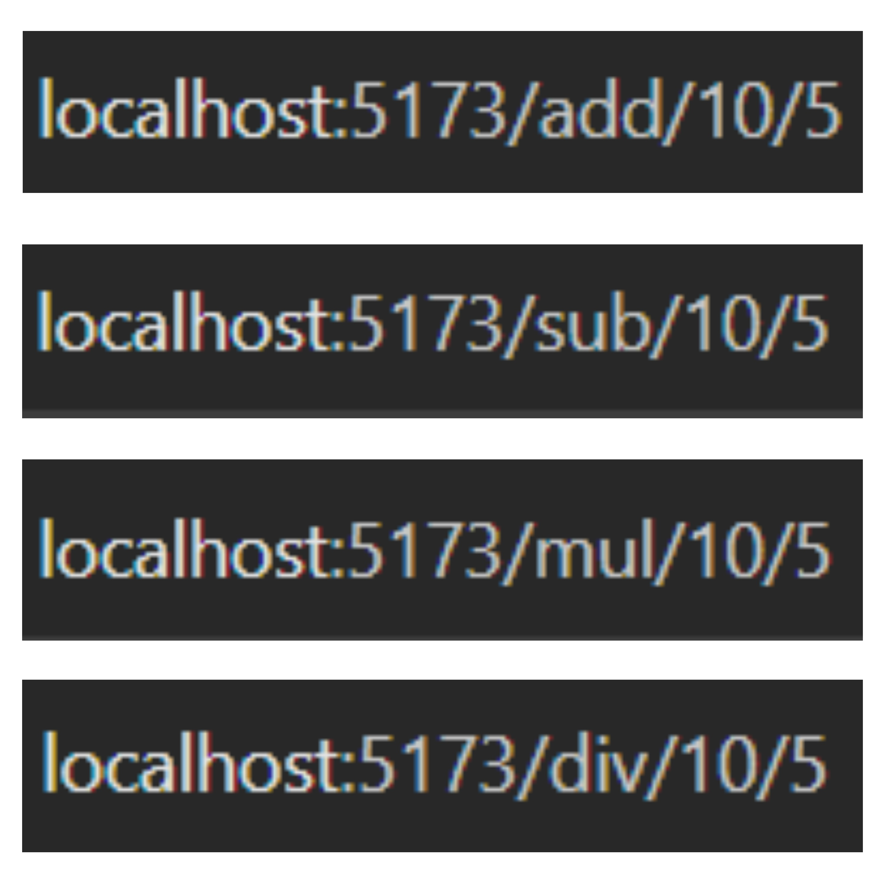
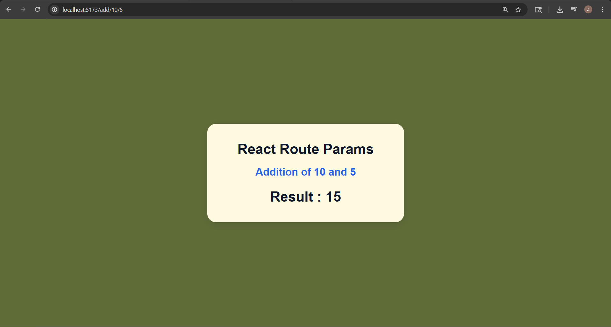
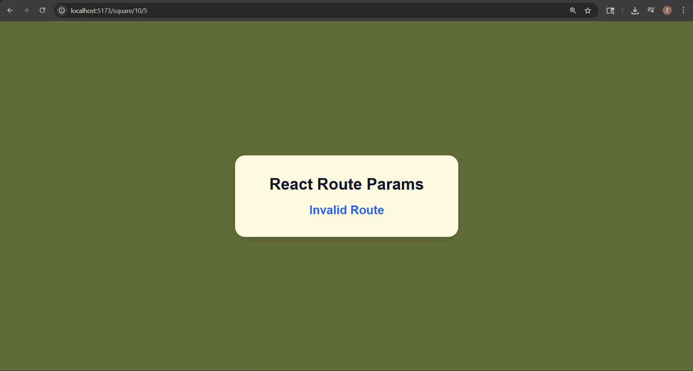

# 📑 Day 9 Task Submission Report

**MERN Stack Internship | Prelytix Private Limited**

| Field             | Details               |
| :---------------- | :-------------------- |
| **Student Name**  | Zaid Pathan           |
| **Internship ID** | ND    |
| **Date**          | 2026-05-21            |
| **Course Day**    | Day 9                 |
| **GitHub Repo**   | https://github.com/zaidpathann/summer_internship.git |

---

# 🎯 Daily Objective

> Understand React Routing and Route Parameters by creating dynamic URL-based operations using React Router DOM.

---

# 🛠️ Implementation & Changes (Self-Documentation)

## 1. New Features / Logic Implemented

* **What:** Built a Route Parameters project using React Router DOM.

* **How:**

  * Installed and configured `react-router-dom`.
  * Implemented dynamic routing using Route Parameters.
  * Used `useParams()` hook to read URL values.
  * Created operation-based routes:

    * Addition
    * Subtraction
    * Multiplication
    * Division
  * Displayed operation message and calculated result dynamically.
  * Implemented conditional rendering for invalid routes.

* **Why:**

  * To understand URL-based routing and dynamic parameter handling in React applications.

---

## 2. UI/UX Enhancements

* Added responsive centered layout.
* Added clean card-based UI design.
* Added dynamic operation message display.
* Added highlighted result section.
* Added simple and user-friendly interface.

---

## 3. Database / Backend Updates

* No backend or database integration was required for Day 9 tasks.

---

# 💻 Code Snippet: My Primary Contribution

```jsx id="8r1x8m"
const {
   operation,
   num1,
   num2
} = useParams()
```

This hook was used to access dynamic URL parameters and display operation-based results.

---

# 📸 Screenshots / Proof of Work

## Routes



---

## Route Example



---

## Invalid Route Handling



---

# 🛑 Challenges Faced & Solutions

## Problem

* Dynamic route values were not updating properly initially.

## Solution

* Used `useParams()` hook to access URL parameters dynamically.

---

## Problem

* Mathematical operations were returning incorrect results.

## Solution

* Converted route parameters into numbers using `Number()` function.

---

# 💡 Key Learnings

* Learned React Router DOM.
* Learned dynamic routing concepts.
* Learned Route Parameters handling.
* Learned `useParams()` hook usage.
* Learned URL-based rendering.
* Learned conditional rendering in React.

---

# 🔗 Live Preview 

* Deployment not done yet.

---

**Signature:**
Zaid Pathan
