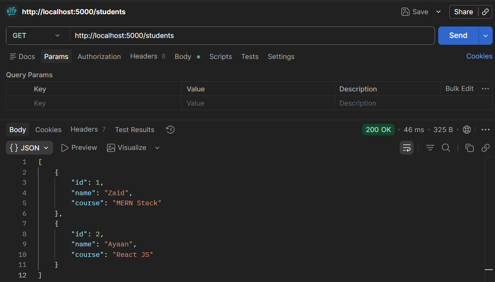
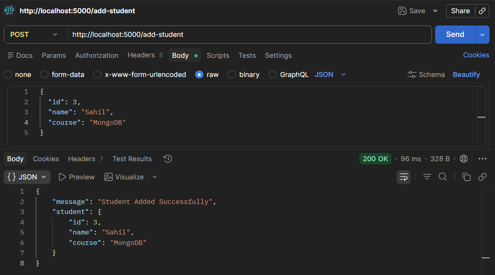

# 📑 Day 10 Task Submission Report

**MERN Stack Internship | Prelytix Private Limited**

| Field             | Details               |
| :---------------- | :-------------------- |
| **Student Name**  | Zaid Pathan           |
| **Internship ID** | ND    |
| **Date**          | 2026-05-22            |
| **Course Day**    | Day 10                |
| **GitHub Repo**   | https://github.com/zaidpathann/summer_internship.git |

---

# 🎯 Daily Objective

> Learn API Testing concepts using Postman and practice HTTP request-response handling with Express JS APIs.

---

# 🛠️ Implementation & Changes (Self-Documentation)

## 1. New Features / Logic Implemented

* **What:** Built and tested Student APIs using Express JS and Postman.

* **How:**

  * Created Express server using Node.js.
  * Implemented GET API to fetch student data.
  * Implemented POST API to add new student data.
  * Used `express.json()` middleware for JSON handling.
  * Stored student data inside `students.json` file.
  * Tested APIs using Postman requests and responses.

* **Why:**

  * To understand API testing workflow and backend request-response handling.

---

## 2. UI/UX Enhancements

* No frontend UI was required for Day 10 tasks.
* Focus was on backend API testing and JSON response handling.

---

## 3. Database / Backend Updates

* Created Express server on port `5000`.
* Implemented APIs:

  * `GET /students`
  * `POST /add-student`
* Stored and updated student records inside JSON file.

---

# 💻 Code Snippet: My Primary Contribution

```js id="z6k5t3"
app.post("/add-student", (req, res) => {

   const newStudent = req.body

   students.push(newStudent)

   res.json({
      message: "Student Added Successfully"
   })

})
```

This API was used to receive student data from Postman and store it in the backend.

---

# 📸 Screenshots / Proof of Work

## GET API Response in Postman



---

## POST API Response in Postman



---

## Updated students.json File


---

# 🛑 Challenges Faced & Solutions

## Problem

* POST request data was not being received correctly initially.

## Solution

* Added `express.json()` middleware to parse JSON request body.

---

## Problem

* API responses were not updating in JSON file.

## Solution

* Implemented file read/write handling using `fs` module.

---

# 💡 Key Learnings

* Learned API testing using Postman.
* Learned GET and POST request handling.
* Learned Express middleware usage.
* Learned JSON data handling.
* Learned request-response workflow.
* Learned backend API testing concepts.

---

# 🔗 Live Preview 

* Deployment not done yet.

---

**Signature:**
Zaid Pathan
