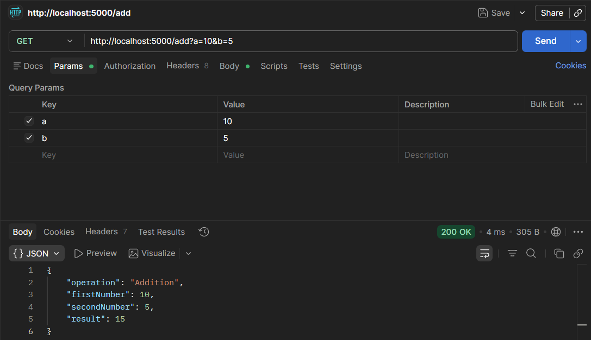
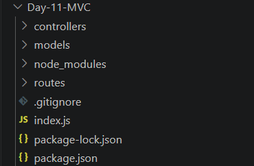

# 📑 Day 11 Task Submission Report

**MERN Stack Internship | Prelytix Private Limited**

| Field             | Details               |
| :---------------- | :-------------------- |
| **Student Name**  | Zaid Pathan           |
| **Internship ID** | ND    |
| **Date**          | 2026-05-25            |
| **Course Day**    | Day 11                |
| **GitHub Repo**   | https://github.com/zaidpathann/summer_internship.git |

---

# 🎯 Daily Objective

> Understand MVC Architecture and Query Parameters by creating modular Express APIs using routes and controllers.

---

# 🛠️ Implementation & Changes (Self-Documentation)

## 1. New Features / Logic Implemented

* **What:** Built Calculator APIs using MVC Architecture in Express JS.

* **How:**

  * Created separate folders for routes and controllers.
  * Implemented modular backend structure.
  * Created Addition and Subtraction APIs.
  * Used Query Parameters for dynamic input values.
  * Accessed URL values using `req.query`.
  * Returned JSON responses from controller functions.
  * Tested APIs using browser and Postman.

* **Why:**

  * To understand clean backend architecture and dynamic API handling using query parameters.

---

## 2. UI/UX Enhancements

* No frontend UI was required for Day 11 tasks.
* Focus was on backend routing and API structure.

---

## 3. Database / Backend Updates

* Created Express server on port `5000`.
* Implemented APIs:

  * `GET /add`
  * `GET /sub`
* Used query parameters:

```text id="jlwm701"
?a=10&b=5
```

* Implemented MVC folder structure:

  * controllers
  * routes

---

# 💻 Code Snippet: My Primary Contribution

```js id="jlwm702"
const a = Number(req.query.a)

const b = Number(req.query.b)

const result = a + b
```

This logic was used to read query parameters dynamically and perform mathematical operations.

---

# 📸 Screenshots / Proof of Work

## Addition API Response



---

## Subtraction API Response


---

## MVC Project Structure



---

# 🛑 Challenges Faced & Solutions

## Problem

* Query parameter values were being treated as strings initially.

## Solution

* Converted values into numbers using `Number()` function.

---

## Problem

* Backend code became difficult to manage in a single file.

## Solution

* Implemented MVC Architecture using separate routes and controllers.

---

# 💡 Key Learnings

* Learned MVC Architecture concepts.
* Learned modular backend development.
* Learned Query Parameters handling.
* Learned `req.query` usage.
* Learned Express routing concepts.
* Learned controller-based API structure.

---

# 🔗 Live Preview 

* Deployment not done yet.

---

**Signature:**
Zaid Pathan
