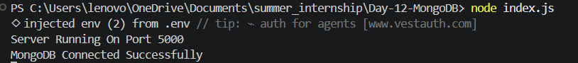
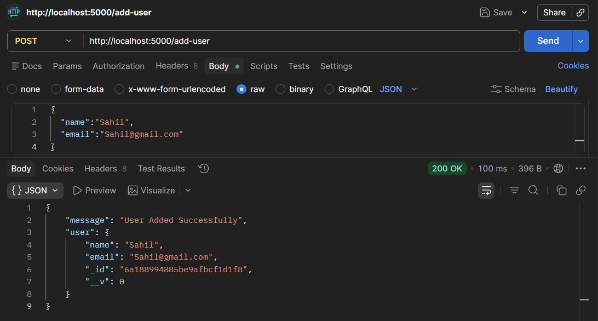
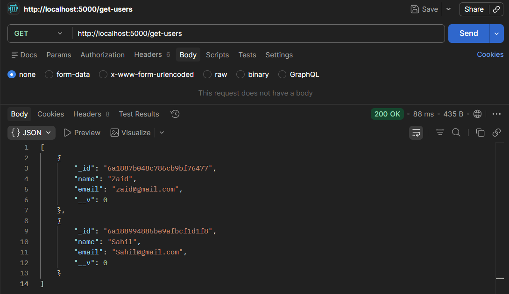
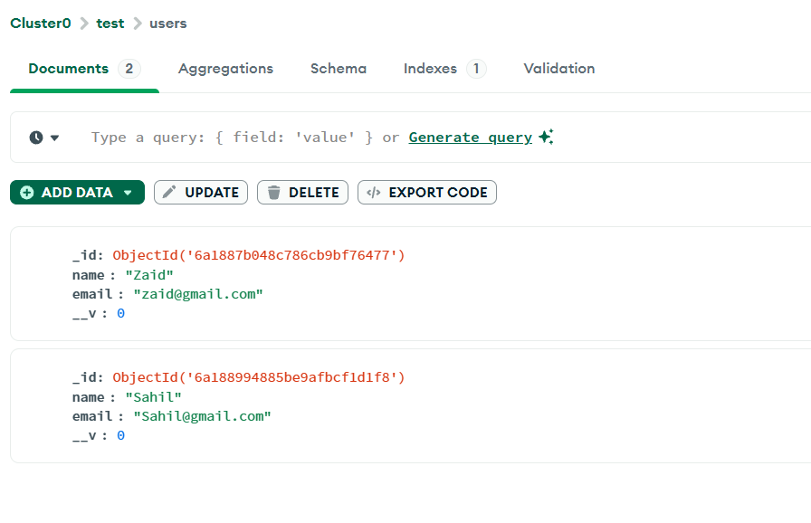

# 📑 Day 12 Task Submission Report

**MERN Stack Internship | Prelytix Private Limited**

| Field             | Details               |
| :---------------- | :-------------------- |
| **Student Name**  | Zaid Pathan           |
| **Internship ID** | ND    |
| **Date**          | 2026-05-26            |
| **Course Day**    | Day 12                |
| **GitHub Repo**   | https://github.com/zaidpathann/summer_internship.git |

---

# 🎯 Daily Objective

> Understand MongoDB Atlas integration and implement MVC Architecture with Express JS and Mongoose for database operations.

---

# 🛠️ Implementation & Changes (Self-Documentation)

## 1. New Features / Logic Implemented

* **What:** Built a MongoDB Atlas integration project using MVC Architecture.

* **How:**

  * Created MongoDB Atlas cluster and connected backend using Mongoose.
  * Configured environment variables using `.env` file.
  * Created separate folders for:

    * Models
    * Controllers
    * Routes
    * Config
  * Created User Schema using Mongoose.
  * Implemented Add User API using `POST` request.
  * Implemented Get Users API using `GET` request.
  * Connected backend server with MongoDB Atlas database.
  * Tested APIs using Thunder Client / Postman.

* **Why:**

  * To understand cloud database integration and modular backend development using MVC Architecture.

---

## 2. UI/UX Enhancements

* No frontend UI was required for Day 12 tasks.
* Focus was on backend API development and MongoDB integration.

---

## 3. Database / Backend Updates

* Connected MongoDB Atlas database using Mongoose.
* Created APIs:

  * `POST /add-user`
  * `GET /get-users`
* Stored user data in MongoDB Atlas collection.
* Implemented secure database connection using `.env` file.

---

# 💻 Code Snippet: My Primary Contribution

```js
const user = await User.create({

   name:req.body.name,

   email:req.body.email

})
```

This logic was used to insert user data into MongoDB Atlas database.

---

# 📸 Screenshots / Proof of Work

## MongoDB Connected Successfully



---

## Add User API Response



---

## Get Users API Response



---

## MongoDB Atlas Collection Data



---

# 🛑 Challenges Faced & Solutions

## Problem

* MongoDB Atlas connection was failing initially.

## Solution

* Corrected connection string and configured `.env` variables properly.

---

## Problem

* API requests were not storing data in database.

## Solution

* Connected Mongoose model correctly with controllers and routes.

---

# 💡 Key Learnings

* Learned MongoDB Atlas integration.
* Learned Mongoose schema and models.
* Learned MVC Architecture implementation.
* Learned backend modular structure.
* Learned environment variable handling.
* Learned cloud database operations.
* Learned API testing using Thunder Client / Postman.

---

# 🔗 Live Preview 

* Deployment not done yet.

---

**Signature:**
Zaid Pathan
