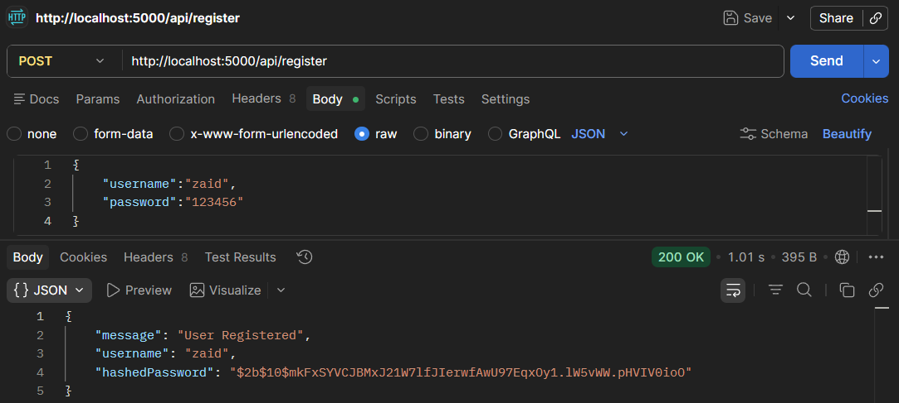
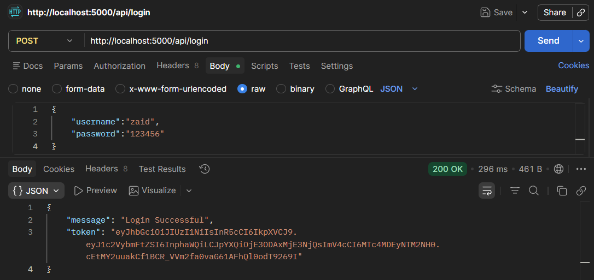
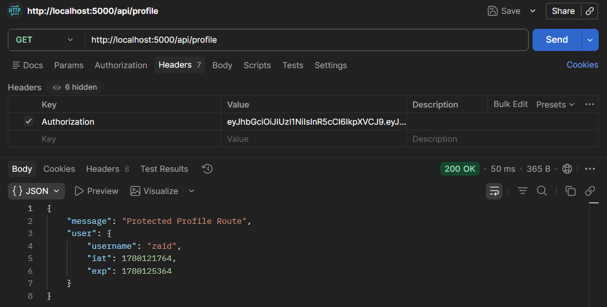
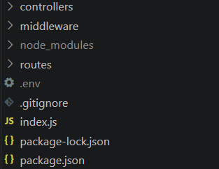

# 📑 Day 14 Task Submission Report

**MERN Stack Internship | Prelytix Private Limited**

| Field             | Details               |
| :---------------- | :-------------------- |
| **Student Name**  | Zaid Pathan           |
| **Internship ID** | ND    |
| **Date**          | 2026-05-28            |
| **Course Day**    | Day 14                |
| **GitHub Repo**   | https://github.com/zaidpathann/summer_internship.git |

---

# 🎯 Daily Objective

> Understand Authentication and Authorization concepts using JWT, Middleware, and Password Hashing techniques in Node.js applications.

---

# 🛠️ Implementation & Changes (Self-Documentation)

## 1. New Features / Logic Implemented

* **What:** Built a JWT-based Authentication System using Express JS.

* **How:**

  * Implemented User Registration API.
  * Implemented User Login API.
  * Used Bcrypt for password hashing.
  * Generated JWT tokens after successful login.
  * Created authentication middleware for token verification.
  * Protected routes using JWT middleware.
  * Tested APIs using Postman.

* **Why:**

  * To understand secure user authentication and route protection mechanisms used in modern web applications.

---

## 2. Security Features Implemented

* Password Hashing using Bcrypt.
* JWT Token Generation.
* JWT Token Verification.
* Middleware-based Route Protection.
* Environment Variable Configuration using `.env`.

---

## 3. Backend Updates

Implemented the following APIs:

* `POST /api/register`
* `POST /api/login`
* `GET /api/profile`

Created project structure using:

* Controllers
* Routes
* Middleware
* Environment Variables

---

# 💻 Code Snippet: My Primary Contribution

```js
const token = jwt.sign(

   { username },

   process.env.JWT_SECRET,

   { expiresIn: "1h" }

)
```

This logic was used to generate a secure JWT token after successful user authentication.

---

# 📸 Screenshots / Proof of Work

## Register API Response



---

## Login API Response with JWT Token



---

## Protected Route Access



---

## Authentication Project Structure



---

# 🛑 Challenges Faced & Solutions

## Problem

* Understanding the difference between Authentication and Authorization.

## Solution

* Studied JWT workflow and middleware-based route protection.

---

## Problem

* Managing secure password storage.

## Solution

* Implemented password hashing using Bcrypt before storing credentials.

---

## Problem

* Accessing protected routes without user verification.

## Solution

* Created authentication middleware to verify JWT tokens before granting access.

---

# 💡 Key Learnings

* Learned Authentication and Authorization concepts.
* Learned JWT Token generation and verification.
* Learned Bcrypt password hashing.
* Learned Middleware implementation.
* Learned Protected Route handling.
* Learned Environment Variable management.
* Learned API testing using Postman.

---

# 🔗 Live Preview 

* Deployment not done yet.

---

**Signature:**
Zaid Pathan
