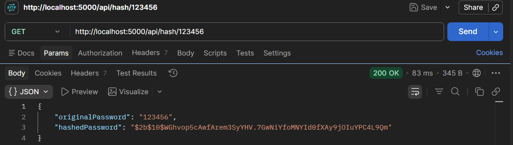
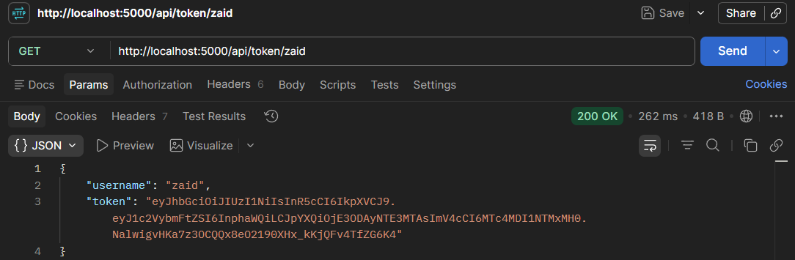

# 📑 Day 15 Task Submission Report

**MERN Stack Internship | Prelytix Private Limited**

| Field             | Details               |
| :---------------- | :-------------------- |
| **Student Name**  | Zaid Pathan           |
| **Internship ID** | ND    |
| **Date**          | 2026-05-29            |
| **Course Day**    | Day 15                |
| **GitHub Repo**   | https://github.com/zaidpathann/summer_internship.git |

---

# 🎯 Daily Objective

> Understand and implement Express Middleware, Bcrypt Password Hashing, JWT Token Generation, Token Verification, and Protected Routes for secure backend applications.

---

# 🛠️ Implementation & Changes (Self-Documentation)

## 1. New Features / Logic Implemented

* **What:** Developed a Middleware and JWT Authentication demonstration project using Express JS.

* **How:**

  * Created custom authentication middleware.
  * Implemented password hashing using Bcrypt.
  * Generated JWT tokens dynamically.
  * Verified JWT tokens using middleware.
  * Created protected routes accessible only after successful token verification.
  * Tested all APIs using Postman.

* **Why:**

  * To understand secure authentication mechanisms and middleware execution flow used in modern backend development.

---

## 2. Security Features Implemented

* Password Hashing using Bcrypt.
* JWT Token Generation.
* JWT Token Verification.
* Custom Middleware Implementation.
* Route Protection using Middleware.

---

## 3. Backend Updates

Implemented the following APIs:

* `GET /api/hash/:password`
* `GET /api/token/:username`
* `GET /api/profile`

Created backend structure using:

* Middleware
* Routes
* Environment Variables
* JWT Authentication

---

# 💻 Code Snippet: My Primary Contribution

```js
const token = jwt.sign(

   { username },

   process.env.JWT_SECRET,

   { expiresIn: "1h" }

)
```

This logic was used to generate JWT tokens for authenticated users.

---

# 📸 Screenshots / Proof of Work

## Password Hashing Response



---

## JWT Token Generation



---

# 🛑 Challenges Faced & Solutions

## Problem

* Understanding middleware execution flow and request lifecycle.

## Solution

* Implemented custom middleware and observed how requests pass through middleware before reaching route handlers.

---

## Problem

* Understanding secure password handling.

## Solution

* Used Bcrypt hashing to securely convert plain text passwords into encrypted hashes.

---

## Problem

* Protecting routes from unauthorized access.

## Solution

* Implemented JWT token verification middleware before granting route access.

---

# 💡 Key Learnings

* Learned Middleware concepts in Express JS.
* Learned custom middleware implementation.
* Learned Bcrypt password hashing.
* Learned JWT token generation and verification.
* Learned route protection mechanisms.
* Learned authentication workflow.
* Learned API testing using Postman.

---

# 🔗 Live Preview 

* Deployment not done yet.

---

**Signature:**
Zaid Pathan
