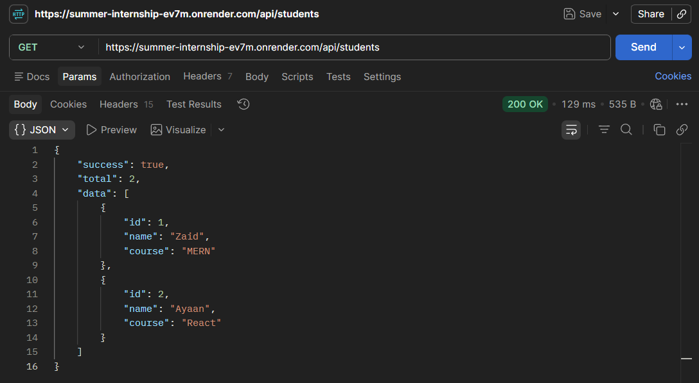
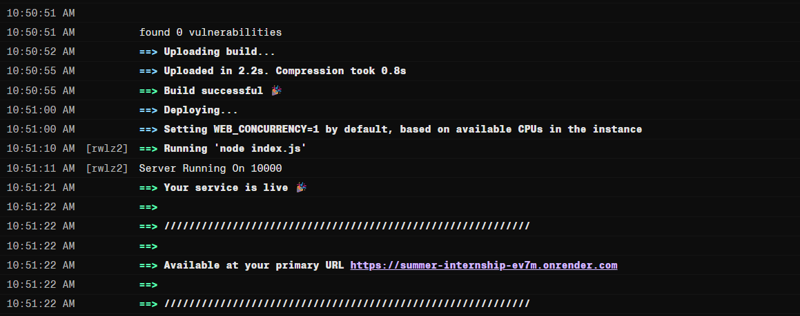
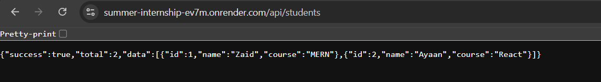

# 📑 Day 16 Task Submission Report

**MERN Stack Internship | Prelytix Private Limited**

| Field             | Details               |
| :---------------- | :-------------------- |
| **Student Name**  | Zaid Pathan           |
| **Internship ID** | ND    |
| **Date**          | 2026-05-30            |
| **Course Day**    | Day 16                |
| **GitHub Repo**   | https://github.com/zaidpathann/summer_internship.git |

---

# 🎯 Daily Objective

> Understand backend deployment workflow by creating APIs, testing endpoints locally, and deploying backend services on Render for public access.

---

# 🛠️ Implementation & Changes (Self-Documentation)

## 1. New Features / Logic Implemented

* **What:** Built and deployed a backend API project using Express JS and Render.

* **How:**

  * Created Express server and configured application structure.
  * Implemented API routes to return browser and JSON responses.
  * Tested routes locally using browser and Postman.
  * Configured project for production deployment.
  * Connected GitHub repository with Render.
  * Deployed backend successfully and generated a live URL.
  * Verified deployed APIs through browser and API testing tools.

* **Why:**

  * To understand how backend applications move from local development to live production environments.

---

## 2. Deployment Features Implemented

* Express Backend Deployment
* Route Testing
* Production Build Configuration
* Live API Access
* GitHub Integration
* Render Deployment Workflow

---

## 3. Backend Updates

Implemented routes such as:

* `GET /`
* `GET /api/students`
* `GET /api/students/:id`

Configured:

* Production Start Command
* Deployment Settings
* Browser Testing
* API Validation

---

# 💻 Code Snippet: My Primary Contribution

```js
app.use(

"/api",

require(

"./routes/studentRoutes"

)

)
```

This configuration was used to register backend routes and expose APIs after deployment.

---

# 📸 Screenshots / Proof of Work

## Postman API Testing



---

## Render Deployment Successful



---

## Live Backend URL Working



---

# 🛑 Challenges Faced & Solutions

## Problem

* Deployment initially failed due to project configuration and missing deployment setup.

## Solution

* Verified repository structure, configured build and start commands correctly, and redeployed the project.

---

## Problem

* APIs were working locally but required validation after deployment.

## Solution

* Tested live endpoints using browser and Postman to confirm deployment success.

---

# 💡 Key Learnings

* Learned backend deployment workflow.
* Learned Render hosting platform.
* Learned production deployment process.
* Learned GitHub integration.
* Learned API verification after deployment.
* Learned live backend testing.
* Learned deployment troubleshooting.

---

# 🔗 Live Preview

Add your deployed Render URL here.

Example:

`https://summer-internship-ev7m.onrender.com/api/students`

---

**Signature:**
Zaid Pathan
