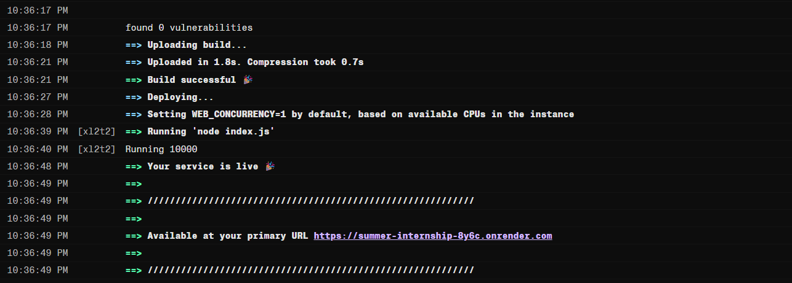
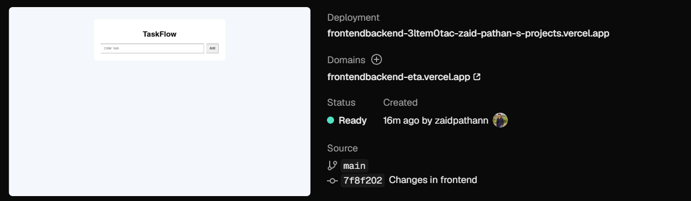

# 📑 Day 17 Task Submission Report

**MERN Stack Internship | Prelytix Private Limited**

| Field             | Details                                              |
| :---------------- | :--------------------------------------------------- |
| **Student Name**  | Zaid Pathan                                          |
| **Internship ID** | ND                                                   |
| **Date**          | 2026-06-02                                           |
| **Course Day**    | Day 17                                               |
| **GitHub Repo**   | https://github.com/zaidpathann/summer_internship.git |

---

# 🎯 Daily Objective

> Understand Full Stack Deployment workflow and deploy the TaskFlow project by hosting frontend and backend separately while enabling production communication.

---

# 🛠️ Implementation & Changes (Self-Documentation)

## 1. New Features / Logic Implemented

* **What:** Implemented Full Stack Deployment setup for TaskFlow project using deployed backend and Vercel frontend deployment workflow.

* **How:**

  * Verified previously deployed backend service.
  * Prepared React frontend for production deployment.
  * Configured environment variables using `.env`.
  * Replaced localhost API endpoints with production-ready URLs.
  * Connected frontend with deployed backend.
  * Started deployment process using Vercel.
  * Monitored build logs and deployment status.
  * Debugged frontend build failure.
  * Installed missing frontend dependencies.

* **Why:**

  * To understand real-world deployment architecture and make the full stack application accessible in a production environment.

---

## 2. UI/UX Enhancements

* Prepared frontend UI for production deployment.
* Verified frontend rendering after deployment build.
* Maintained responsive design compatibility.
* Improved API integration for hosted environment.

---

## 3. Database / Backend Updates

* Verified deployed backend connectivity.
* Configured frontend to communicate with hosted backend.
* Updated API configuration using environment variables.

Example:

```text
VITE_API_URL=https://summer-internship-8y6c.onrender.com
```

* Prepared backend configuration for production deployment.

---

# 💻 Code Snippet: My Primary Contribution

```jsx
const API = import.meta.env.frontendbackend-eta.vercel.app

axios.get(`${API}/tasks`)
```

This configuration was used to dynamically connect frontend requests with the deployed backend environment.

---

# 📸 Screenshots / Proof of Work

## Backend Successfully Deployed



---

## Vercel Frontend Deployment Setup



---

# 🛑 Challenges Faced & Solutions

## Problem

* Frontend deployment failed during Vercel production build.

## Solution

* Checked deployment logs and identified missing frontend dependency.

---

## Problem

* Build failed because `axios` package was not resolved.

## Solution

* Installed axios package using npm and updated project dependencies.

---

## Problem

* Localhost API endpoints were not working after deployment.

## Solution

* Moved API URLs into environment variables using `frontendbackend-eta.vercel.app`.

---

# 💡 Key Learnings

* Learned Full Stack Deployment workflow.
* Learned Vercel deployment process.
* Learned production environment configuration.
* Learned environment variables in Vite.
* Learned deployment debugging using build logs.
* Learned frontend-backend production communication.

---

# 🔗 Live Preview

* **Backend:** Deployment completed.
* **Frontend:** Deployment completed.

---

**Signature:**
Zaid Pathan
