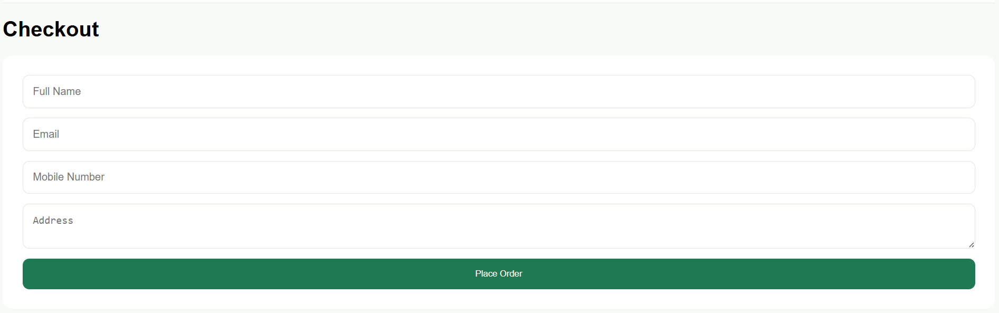

# 📑 Day 18 Task Submission Report

**MERN Stack Internship | Prelytix Private Limited**

| Field             | Details               |
| :---------------- | :-------------------- |
| **Student Name**  | Zaid Pathan           |
| **Internship ID** | ND    |
| **Date**          | 2026-06-06            |
| **Course Day**    | Day 18                |
| **GitHub Repo**   | https://github.com/zaidpathann/summer_internship.git |

---

# 🎯 Daily Objective

> Understand and implement React Forms by integrating form handling, state management, validation, and event handling into an existing React application.

---

# 🛠️ Implementation & Changes (Self-Documentation)

## 1. New Features / Logic Implemented

* **What:** Integrated React Forms into the existing Smart Cart System.

* **How:**

  * Added checkout form inside Checkout page.
  * Created controlled form components using React state.
  * Managed input values using `useState`.
  * Implemented `onChange` event handling.
  * Implemented `onSubmit` form submission handling.
  * Added form validation for empty fields.
  * Displayed entered user data in browser console after submission.

* **Why:**

  * To understand real-world React form handling and user input management.

---

## 2. React Concepts Implemented

Implemented:

* Controlled Components
* useState Hook
* Form Handling
* Event Handling
* Form Validation
* State Updates
* Conditional Rendering

---

## 3. Application Updates

Modified:

* Checkout Page
* Form Submission Flow
* User Input Handling

Added Form Fields:

* Full Name
* Email
* Mobile Number
* Address

Implemented Functionalities:

* Input Capture
* Validation
* Console Output
* Success Message

---

# 💻 Code Snippet: My Primary Contribution

```js
const handleSubmit = (e) => {

e.preventDefault()

console.log(

"Order Details:",

form

)

}
```

This logic was used to capture and display submitted form data through React form handling.

---

# 📸 Screenshots / Proof of Work

## Checkout Form UI



---

# 🛑 Challenges Faced & Solutions

## Problem

* Managing multiple input fields and updating values dynamically.

## Solution

* Implemented controlled components using `useState`.

---

## Problem

* Handling form submission without page refresh.

## Solution

* Used `preventDefault()` and custom submit handling.

---

## Problem

* Managing validation before processing data.

## Solution

* Added field validation and conditional checks.

---

# 💡 Key Learnings

* Learned React Forms.
* Learned Controlled Components.
* Learned Event Handling.
* Learned Form Validation.
* Learned useState for Forms.
* Learned Input Management.
* Learned Submit Handling.
* Learned React Application Enhancement.

---

# 🔗 Live Preview 

[Deployed URL](react-forms-ashy.vercel.app)

---

**Signature:**
Zaid Pathan
