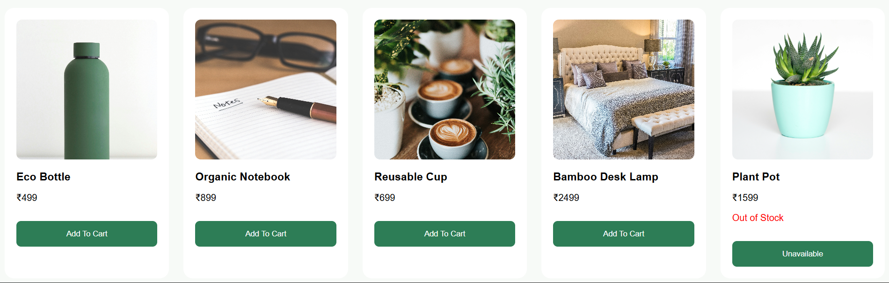
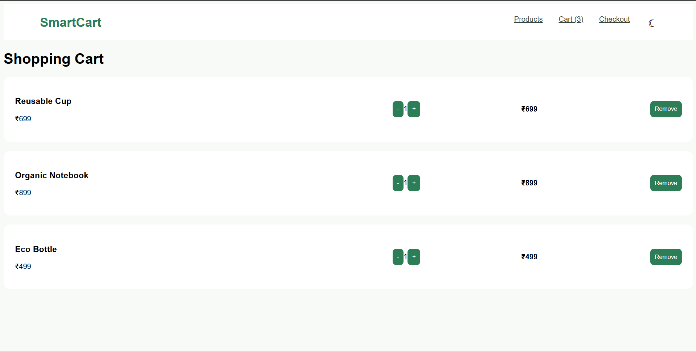
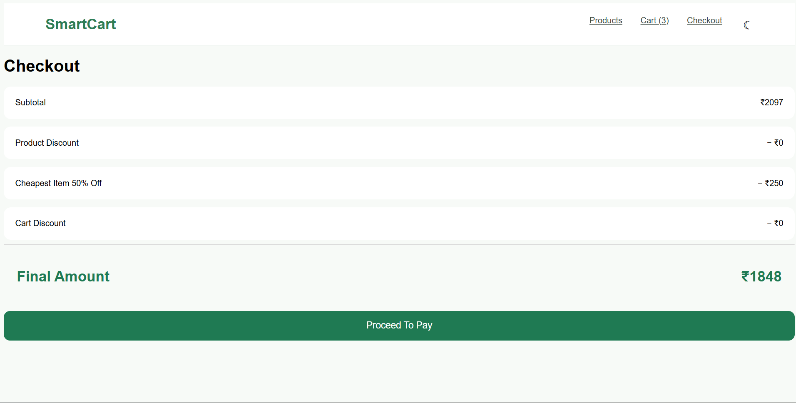
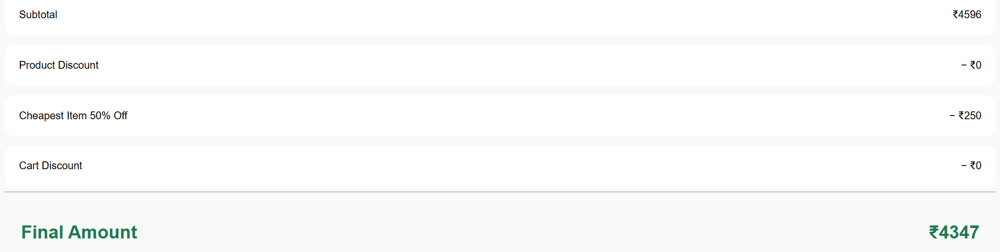
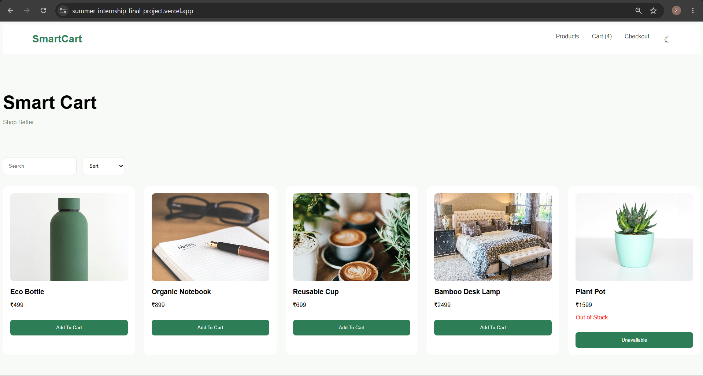

# 📑 Final Task Submission Report

**MERN Stack Internship | Prelytix Private Limited**

| Field             | Details               |
| :---------------- | :-------------------- |
| **Student Name**  | Zaid Pathan           |
| **Internship ID** | ND    |
| **Date**          | 2026-06-09            |
| **Course Day**    | Day 20                |
| **GitHub Repo**   | https://github.com/zaidpathann/summer_internship.git |
| **Live URL**      | summer-internship-final-project.vercel.app |

---

# 🎯 Daily Objective

> Develop and deploy a complete frontend application by implementing product browsing, cart management, checkout workflow, business logic, reusable components, and production deployment.

---

# 🛠️ Implementation & Changes (Self-Documentation)

## 1. New Features / Logic Implemented

* **What:** Built and deployed a Smart Cart System using React.

* **How:**

  * Created product listing using local JSON data.
  * Implemented shopping cart management using Context API.
  * Added quantity controls and cart validations.
  * Implemented checkout page with discount calculations.
  * Added custom business logic for discount handling.
  * Used React Router for multi-page navigation.
  * Implemented lazy loading using React Lazy and Suspense.
  * Added Local Storage for persistent cart state.
  * Deployed final application successfully.

* **Why:**

  * To understand real-world frontend architecture, state management, and deployment workflow.

---

## 2. UI / UX Enhancements

* Implemented professional green and white theme.
* Created reusable UI components.
* Added responsive product cards.
* Added search and sorting functionality.
* Implemented dark mode support.
* Improved user navigation and checkout experience.

---

## 3. Application Features Implemented

Implemented pages:

* Products Page
* Cart Page
* Checkout Page

Implemented functionalities:

* Product Listing
* Add To Cart
* Quantity Management
* Remove Item
* Checkout Summary
* Discount Calculations
* Persistent Cart

Implemented Discount Rules:

* Product Discount (10%)
* Cart Discount (5%)
* Custom Discount:
  Cheapest Item 50% Off

---

# 💻 Code Snippet: My Primary Contribution

```js
const finalAmount =

subtotal

-

productDiscount

-

cheapestDiscount

-

cartDiscount
```

This logic was used to calculate the final payable amount after applying all discount conditions.

---

# 📸 Screenshots / Proof of Work

## Product Listing Page



---

## Cart Page



---

## Checkout Page



---

## Discount Calculation



---

## Final Deployed Website



---

# 🛑 Challenges Faced & Solutions

## Problem

* Managing multiple discount rules and maintaining calculation order.

## Solution

* Created centralized discount utility for all business calculations.

---

## Problem

* Preserving cart state after refresh.

## Solution

* Implemented Local Storage for persistent data.

---

## Problem

* Managing application state across multiple pages.

## Solution

* Used Context API for centralized state management.

---

# 💡 Key Learnings

* Learned React Router implementation.
* Learned Context API state management.
* Learned reusable component architecture.
* Learned business logic implementation.
* Learned lazy loading optimization.
* Learned cart and checkout workflow.
* Learned frontend deployment process.

---

# 🔗 Live Preview (If applicable)

summer-internship-final-project.vercel.app

---

**Signature:**
Zaid Pathan
