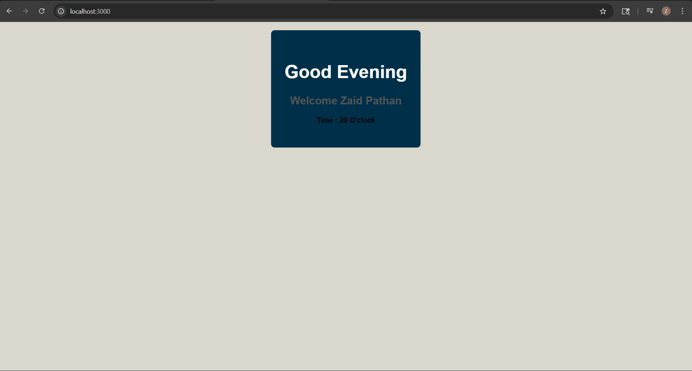

# 🚀 Developer Stamina Dashboard

## 📌 Project Overview

The Developer Stamina Dashboard is a React-based application built using Vite.
This project was developed as part of the MERN Stack Internship Day 1 tasks.

The dashboard tracks developer stamina, displays dynamic greetings based on system time, and renders reusable skill components using React props.

---

# ⚙️ Technologies Used

* React JS
* Vite
* JavaScript
* CSS3

---

# ✨ Features

* Dynamic greeting system
* Environment variable integration
* Reusable React components
* Skill prop injection
* Stamina state management
* Burnout button disable logic
* Responsive UI structure

---

# 📂 Project Structure

```bash
src/
│
├── components/
│   ├── Header.jsx
│   ├── SkillList.jsx
│   └── SkillBadge.jsx
│
├── App.jsx
├── App.css
├── index.css
└── main.jsx
```

---

# 🧠 Virtual DOM Explanation

React uses the Virtual DOM to improve performance during UI updates.

When the stamina value changes, React first updates the Virtual DOM instead of directly updating the real DOM. React then compares the previous and updated Virtual DOM states and updates only the changed elements efficiently.

---

# 💻 Modulus Logic Used

```javascript
if(newClickCount % 5 === 0){
   reduction = 15
}
```

This logic applies a critical stamina reduction every 5th click using the modulus operator.

---

# ⚔️ Vite vs Create React App (CRA)

| Vite                                 | CRA                         |
| ------------------------------------ | --------------------------- |
| Faster development server            | Slower startup time         |
| Uses native ES modules               | Uses Webpack bundling       |
| Instant Hot Module Replacement (HMR) | Slower HMR                  |
| Lightweight and modern               | Larger project setup        |
| Better performance                   | More configuration overhead |

---

# 📸 Screenshots

## Task 1 - Environment Setup


---

## Task 2 - Dynamic Greeting



---

## Task 3 - Skill Props


---

## Task 4 - Stamina Running


---

## Task 4 - Burnout State


---

# 👨‍💻 Author

Zaid Pathan

Summer Internship - Day 1
